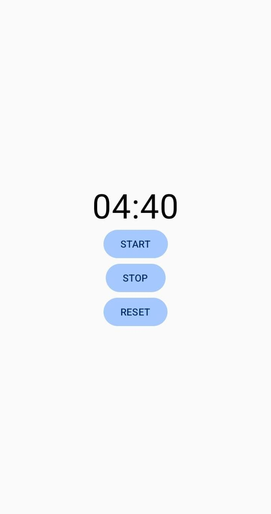

# Timer App

A simple countdown timer Android application built using Kotlin and Jetpack Compose.

## Features

- Start the timer
- Stop the timer
- Reset the timer to 5 minutes
- Timer state survives screen rotation

## Technologies Used

- Kotlin
- Jetpack Compose
- Android Studio

## How It Works

The timer starts at 5 minutes. Pressing **START** begins the countdown, **STOP** pauses it, and **RESET** returns the timer to 5 minutes.

The application uses Compose state and `rememberSaveable` so that the timer state is preserved when the screen is rotated.

## Security Considerations

### 1. Inadequate Supply Chain Security

The application uses Android and Jetpack Compose dependencies. These dependencies should come from trusted sources and should be kept updated to reduce potential security risks.

### 2. Improper Credential Usage

This timer application does not require usernames, passwords, or other credentials. Therefore, it does not collect or store unnecessary sensitive authentication information.

## Screenshot

The Timer App running on an Android device:

